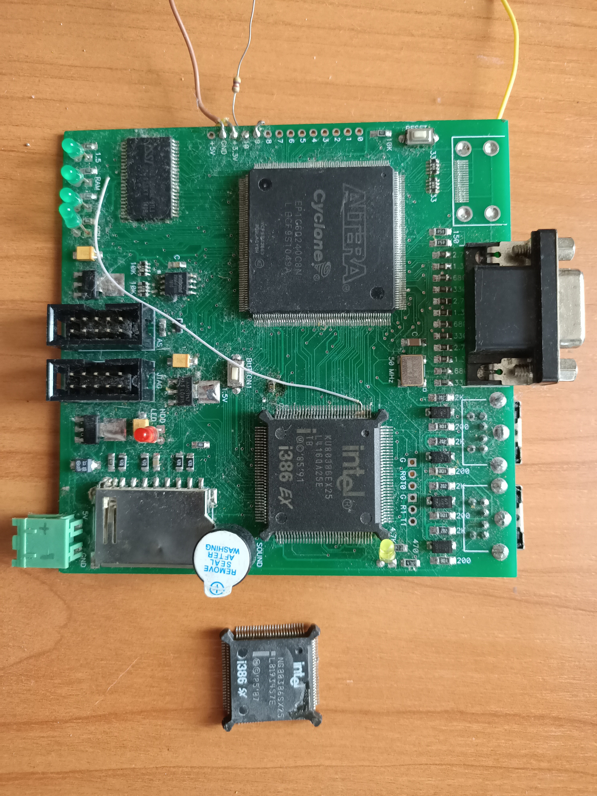

Here are some photos of devices that I created during the development of this program.

- CPU: Harris 80286 @ 16 MHz
- RAM: 2 x 512 KB static (10 ns cycle)
- FPGA: Altera Cyclone EP1C3T100C8N
- Interfaces: 1 x VGA, 1 x PS/2, 1 x SPI, 1 x RS232 (TTL)
- Disk: 16 megabyte EEPROM W25Q128

Top layer:

Bottom layer:

- CPU: Intel KU80386EX TB (3.3V version) @ 25 MHz
- RAM: 32 MB SDRAM (10 ns cycle)
- VRAM: 512 KB (10 ns cycle)
- FPGA: Altera Cyclone EP1C6T240C8N
- Interfaces: 1 x VGA, 2 x PS/2, 1 x SPI, 2 x RS232 (TTL), 1 x HDMI
- Disk: MMC via SPI

